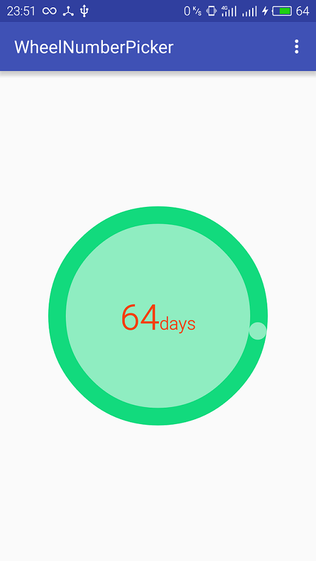
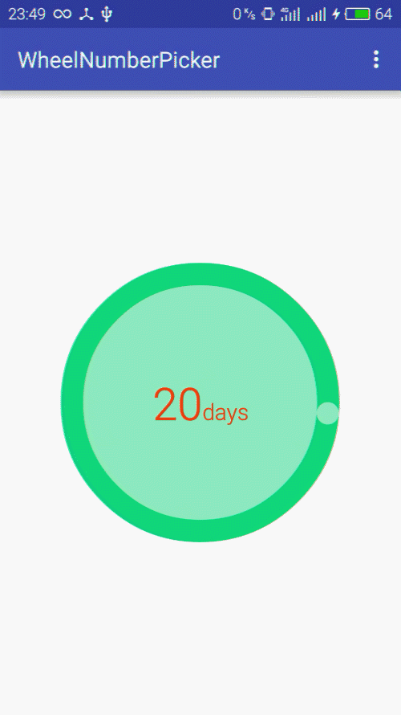

# WheelNumberPicker
a custom number picker widget that you can adjust the value by rotating the wheel

# Screenshot



# Usage
```xml
<com.sunny.wheelnumberpicker.lib.WheelNumberPicker
    xmlns:app="http://schemas.android.com/apk/res-auto"
    android:id="@+id/picker"
    android:layout_width="250dp"
    android:layout_height="250dp"
    android:textColor="#f44110"
    android:textSize="40sp"
    app:bigCircleColor="#12da7d"
    app:blockSize="2"
    app:indicatorColor="#86ffffff"
    app:initialNumber="20"
    app:maxNumber="100"
    app:minNumber="10"
    app:numOfBlocks="15"
    app:ringWidth="20dp"
    app:smallCircleColor="#86ffffff"
    app:unitText="days"
    app:unitTextSize="20sp" />
```

